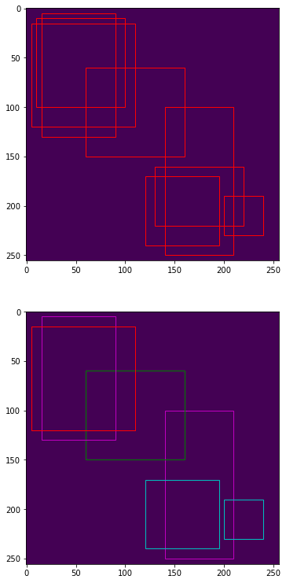

# non-maximum supression implementation

 

## NMS without class

TODO

 

### numpy

 

### tensorflow

  

## NMS with class

### numpy

 

usage : real time

 

 

### tensorflow

 

  

## Soft-NMS with class

TODO

  

## Soft-NMS without class

TODO

  

# Reference

 

- https://www.pyimagesearch.com/2015/02/16/faster-non-maximum-suppression-python/
- https://github.com/OneDirection9/soft-nms/blob/master/py_nms.py
- https://arxiv.org/pdf/1704.04503.pdf
